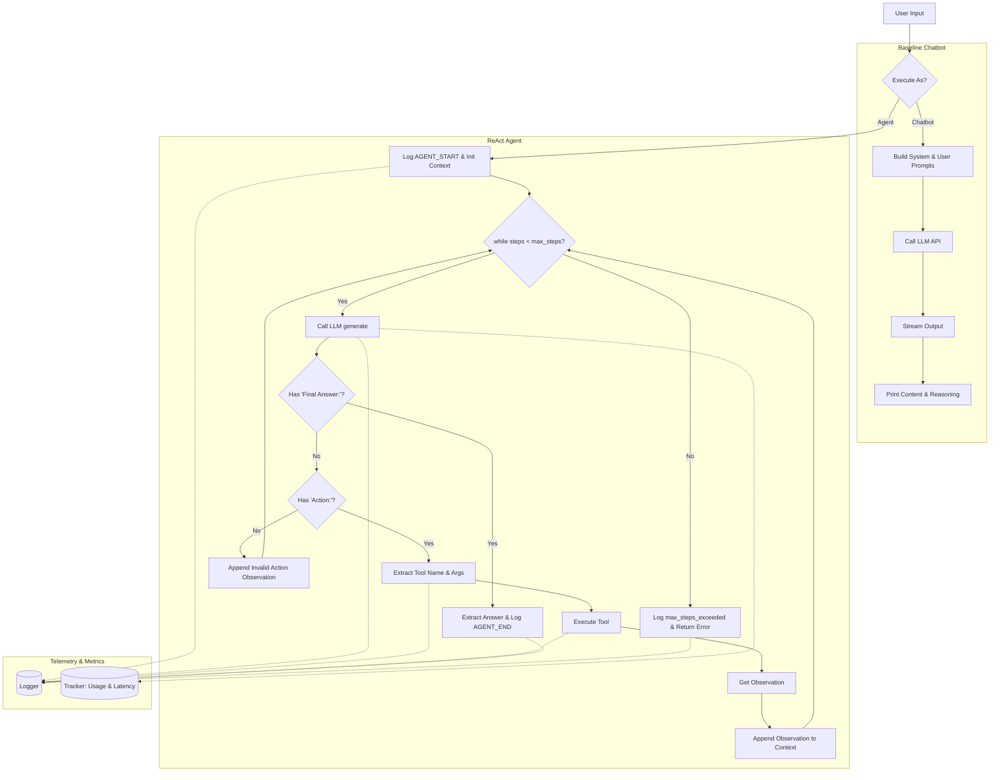

# Flowchart & Insight

This document captures the visual logic of our chatbot-to-agent workflow and the key learning points from the lab.

## 1. Visual Logic Diagram

## 2. Group Insights

- The **baseline chatbot** (`src/chatbot.py`) uses a simple direct API call. It is very fast and handles streaming out of the box, but lacks external interactions, meaning it hallucinate facts (especially current weather or real-time costs).
- The **ReAct loop** (`src/agent/agent.py`) heavily mitigates hallucination by executing tools and appending the *Observation* back to the context. 
- **Parsing logic is critical**: The loop relies on regular expressions matching `Final Answer:` and `Action:`. If the LLM produces a slightly different pattern, the code forces an `[Không tìm thấy Action hợp lệ]` observation.
- **Guardrails & Limits**: `max_steps` prevents the agent from infinitely looping when tool execution continuously fails (as seen in some `max_steps_exceeded` scenarios).
- **Comprehensive Telemetry**: The agent architecture integrates explicit hooks for logging events (`AGENT_START`, `LLM_RESPONSE`, `TOOL_CALL`, `TOOL_RESULT`) and tracking metric usages (`latency_ms`, `total_tokens`), making finding root causes of looped logic or error much easier compared to the baseline chatbot.